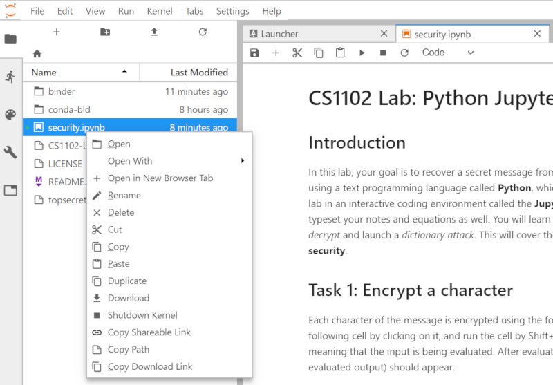

# CS1102-Lab10
CS1102 Lab 10 Security (Python)

To run this lab:
- Click , or visit the url (https://mybinder.org/v2/gh/ccha23/CS1102-Lab10/master?urlpath=lab/tree/security.ipynb)
- A Jupyter notebook will open. You can follow the instructions to modify the codes in the notebook.

Note that your changes will be erased when you close the session. To download your changes:
- Save the notebook by choosing `File`->`Save`
- Open the file panel on the left, right click the file (security.ipynb and mysecret.txt) you want to download.
- A context menu will appear. Choose download to download the file. See the figure below:

